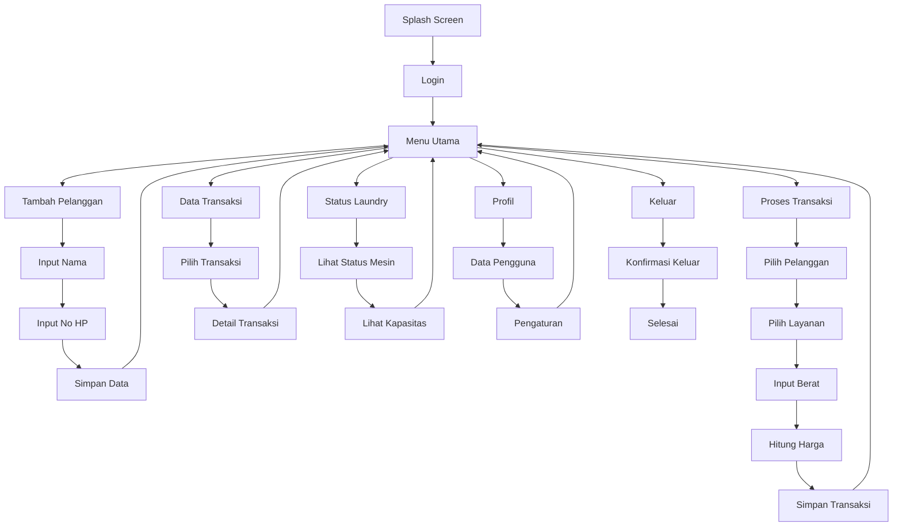
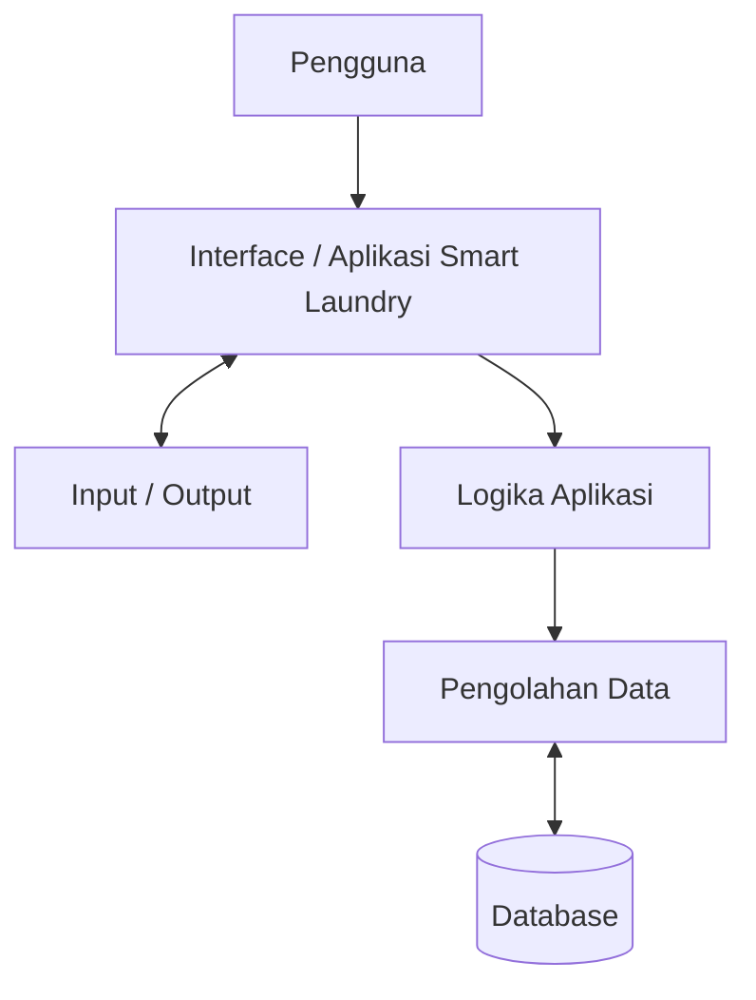
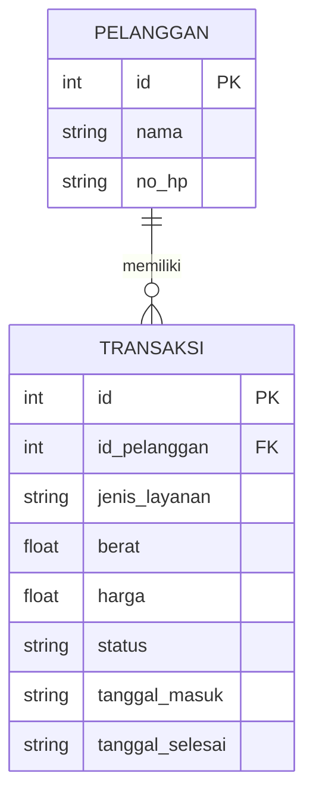

# 2.1 Rancangan UX/UI - Smart Laundry

## 1. Deskripsi

Smart Laundry merupakan aplikasi yang digunakan untuk mengelola data pelanggan, transaksi laundry, status laundry, dan pemantauan proses laundry.

Rancangan UX/UI dibuat agar pengguna dapat menggunakan aplikasi dengan mudah, sederhana, dan jelas.

---

# 2. Alur Navigasi Aplikasi

# 2.2 Rancangan Sistem

## 1. Arsitektur Sistem

---

## 2. Flowchart Sistem

---

## 3. ERD / Struktur Database

---
