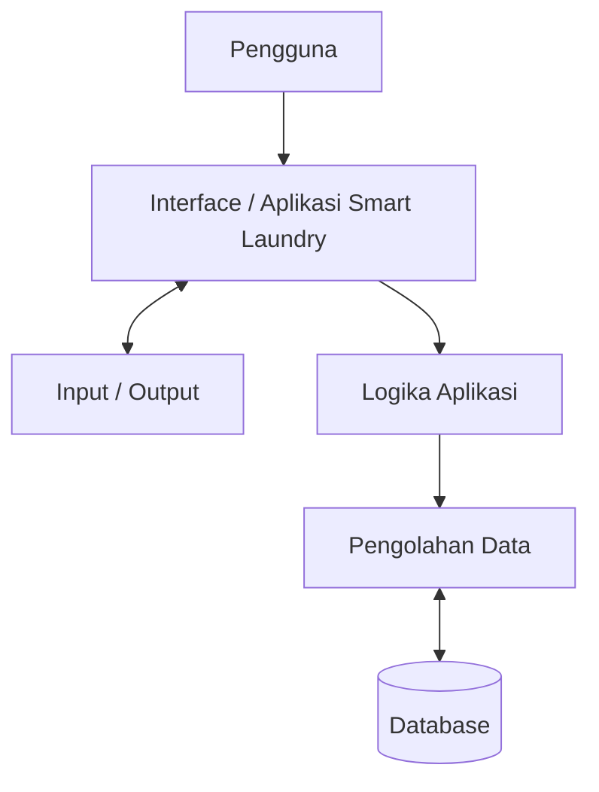
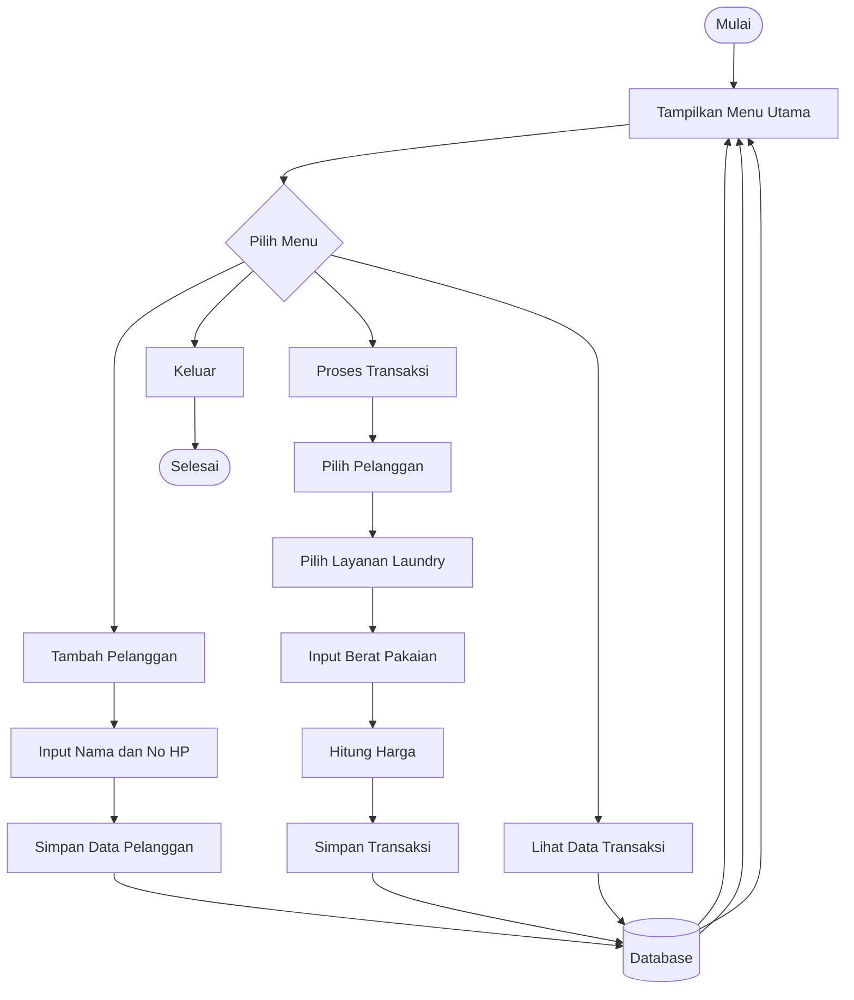
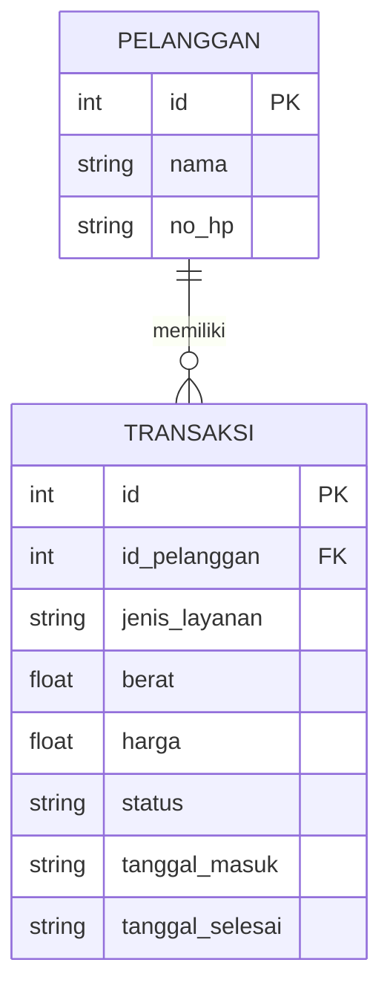

# Dokumen Desain & Arsitektur Sistem - Smart Laundry

## Sistem Digital Twin Pemantauan Mesin Cuci dan Kapasitas Ruang Secara Real-Time

---

## 1. Arsitektur Sistem



---

## 2. Flowchart Sistem



---

## 3. ERD / Struktur Database



---

## 4. Struktur Sistem

```text
Pengguna
   |
   v
Interface Smart Laundry
   |
   v
Logika Aplikasi
   |
   v
Pengolahan Data
   |
   v
Database
```

---

## 5. Fitur Sistem

- Tambah pelanggan
- Menampilkan pelanggan
- Memilih layanan laundry
- Menginput berat pakaian
- Menghitung harga
- Menyimpan transaksi
- Melihat data transaksi
- Menampilkan status laundry

---

## 6. Teknologi

- Python
- SQLite
- Visual Studio Code
- GitHub
- Mermaid Diagram
